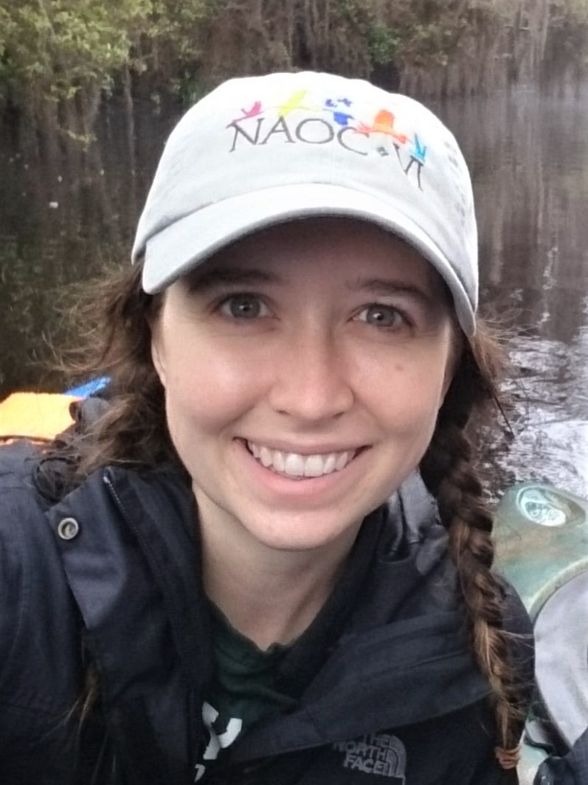

<head>
<link href="//maxcdn.bootstrapcdn.com/font-awesome/4.2.0/css/font-awesome.min.css" rel="stylesheet">
</head>

    

  

{width=80%} 

  

I'm a PhD candidate at Auburn University working with [Conor McGowan](http://www.auburn.edu/~cpm0014/) in the USGS Alabama Fish and Wildlife Cooperative Research Unit. I'm using a long-term mark-recapture dataset from Delaware Bay to understand how shorebirds respond to changing stopover conditions, and how stopover conditions can influence population dynamics and stability. 

I'm broadly interested in understanding the full annual cycle dynamics of migratory species using quantitative tools that help us predict population responses to changing environmental conditions. I'll be graduating in May 2019 and am seeking a postdoc position that combine full life cycle ecology, quantitative methods, and applications to management and conservation issues.  

I completed my Masters degree with [Lesley Bulluck](https://rampages.us/bullucklab/) at VCU, working on questions about the breeding ecology of a box-nesting population of prothonotary warblers. See my Research page for more info about past, present, and future projects!
  \
  \
**email:** amt0046 at auburn.edu

---

  

<a href="https://scholar.google.com/citations?user=S7YLY64AAAAJ&hl=en"> <i class="fa fa-graduation-cap fa-4x"></i>  </a>

  

<a href="https://github.com/annamtucker"> <i class="fa fa-github fa-4x"></i></a>

<a href="https://twitter.com/annamtucker_"> <i class="fa fa-twitter fa-4x"></i></a>

  

<a href="mailto:amt0046@auburn.edu"> <i class="fa fa-envelope fa-4x"></i></a>

