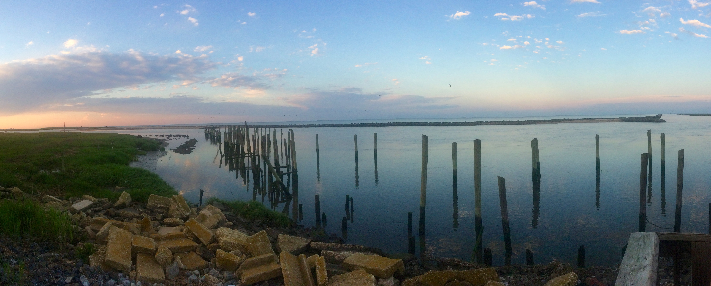

I'm a PhD candidate at Auburn University working with Conor McGowan in the USGS Coop Unit. I'm using a long-term mark-recapture dataset from Delaware Bay to understand how shorebirds respond to changing stopover conditions, and how stopover conditions can influence population dynamics and stability. 

I'm broadly interested in  understanding of the full annual cycle dynamics of migratory species using quantitative tools that help us predict population responses to changing environmental conditions. I'm also looking for a post-doc!

I completed my Masters degree with Lesley Bulluck at VCU, working on questions about the breeding ecology of a box-nesting population of prothonotary warblers. See my Projects page for more info about past, present, and future projects!

_Contact me_

Current address: School of Forestry and Wildlife Sciences, Auburn University

[Twitter](http://twitter.com/annamtucker_)
[Google Scholar](https://scholar.google.com/citations?user=S7YLY64AAAAJ&hl=en)
[Email](mailto:annamtucker@gmail.com)
[Github](http://github.com/annamtucker)