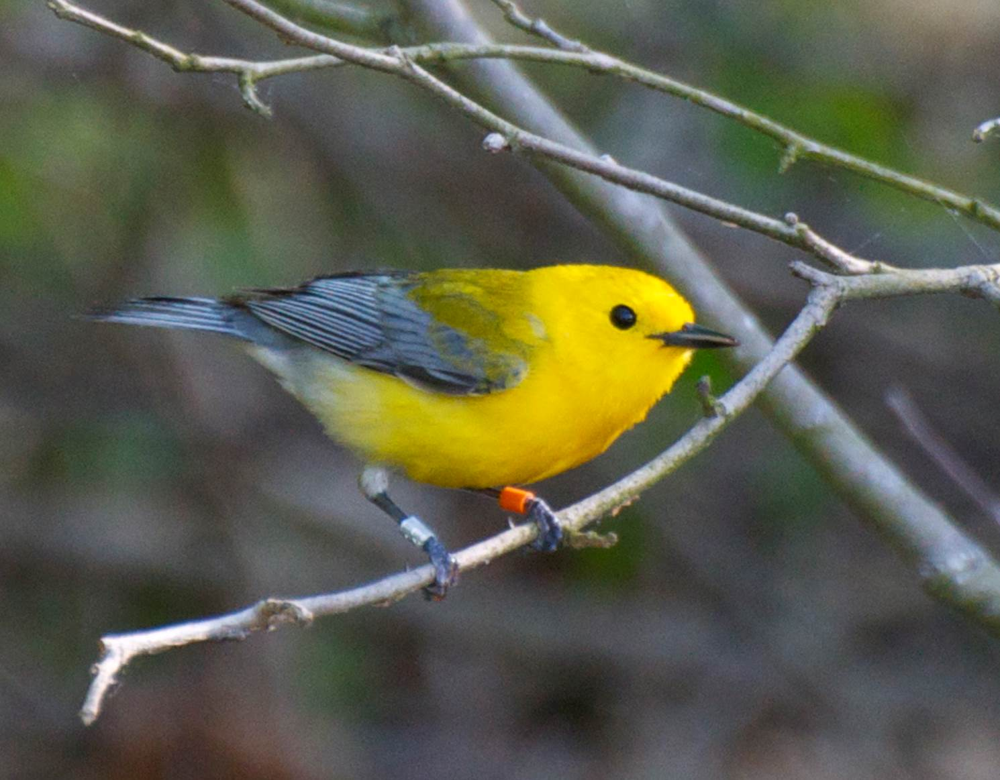
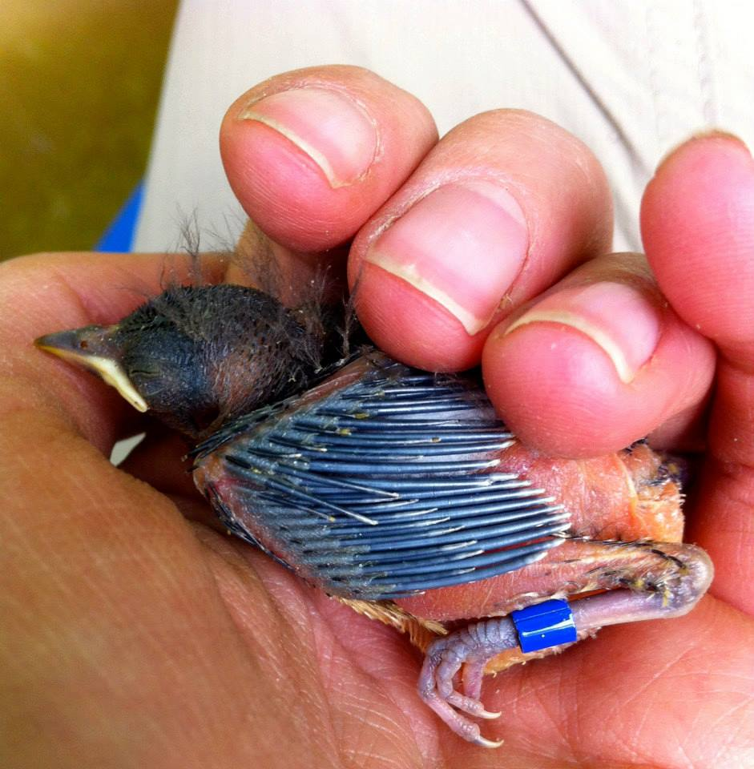

---

**Foraging strategy influences sensitivity to changing stopover conditions**

Many shorebird species use Delaware Bay during spring migration. Red knot have received the most attention because they've experienced drastic population declines, which has been linked to declines in horseshoe crabs. Specializing on a particular, abundant prey item is a good strategy for long-distance migrants as long as that prey item is reliably abundant. When stopover conditions are more unpredictable, it might be a better strategy to be a generalist forager like the ruddy turnstone. I'm comparing capture weights to see if red knot and ruddy turnstone differ in their sensitivity to changing annual food availability, measured as the annual variation in timing and rate of mass gain.

I recently presented on this work at the 2018 AOS Annual Meeting and won an [AOS Council Student Presentation Award](http://www.americanornithology.org/content/2018-aos-student-presentation-award-winners)!

---

**Using network theory to understand bird movements**

Individuals are time- and energy- limited during migration and must use stopover sites efficiently. In Delaware Bay, horseshoe crab eggs are the key prey item for migratory shorebirds, but availability of eggs varies spatially and temporally. Do bird movements track horseshoe crab spawning abundance? 

Regional patterns of site use are also of interest for beach management and conservation efforts in Delaware and New Jersey.

I'm working on evaluating movement patterns using resightings of flagged individuals in a multistate model, and then applying tools from network theory to compare site-use dynamics across species and years.

I presented a [poster](files/euring_poster.pdf) on this work at the Euring Analytical Meeting and Workshop in Barcelona, Spain and won the Best Student Poster award. (*this poster presents work in progress, not for reproduction or citation*)

---

**Delaware Bay shorebird monitoring**

The Delaware Shorebird Project is a collaborative monitoring effort that began in the late 1990s as a response to drastic declines in shorebird numbers in Delaware Bay during spring migration. Every year volunteers in Delaware and New Jersey monitor beaches in the region to count, band, and re-sight shorebirds. This amazing effort has led to an invaluable long-term dataset on the status of shorebirds in the Atlantic Flyway.  

[More information about the Delaware Shorebird Project.](http://www.dnrec.delaware.gov/fw/shorebirds/Pages/default.aspx)

---

**Breeding ecology of prothonotary warblers**

During my Masters I investigating the occurrence and consequences of conspecific brood parasitism in a box-nesting population of prothontary warblers. I also traveled to Panama to help lead a tropical ecology field course for undergraduates, where we banded prothonotary warblers in the mangroves. Since I've left, the team at VCU has partnered with others working with the species to deployed geolocators and estimate migratory connectivity for this species. More info about the cool work they're doing [here](ricerivers.vcu.edu/research/prothonotary-warblers/)

   

